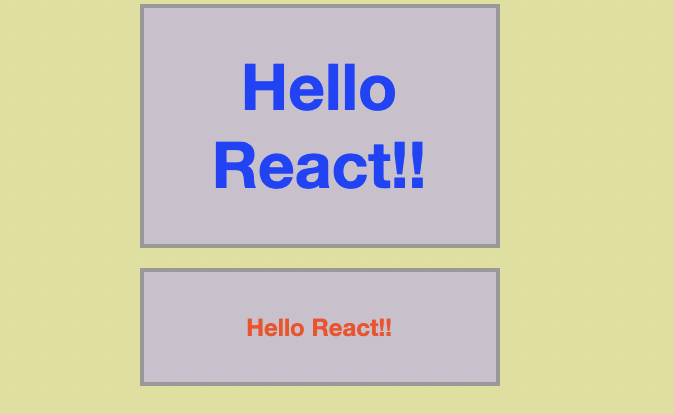

## Component - Component Styling

---
[소스코드](https://github.com/dntjd7701/react-practice/tree/main/component/ex02)

#### 01. src/01 : Inline Styling ****
#### 02. src/02 : Normal CSS( css-loader options{ modules: false});
#### 03. src/03 : Normal CSS( css-loader options{ modules: true});

#### 04. src/04 : CSS Module( css-loader options{ modules: true}); ****
#### 05. CSS in JS **
#### 06. Styled Component **
#### 07. src/07 : SASS & SCSS ****
#### 00. LESS & Stylable **
#### 08. Awesome Font
#### 10. src/09 : react modal
#### 11. src/10 : Material UI

---
### Run Examples

```bahs
$ npm run debug src={no} css-modules=false
``` 
[webpack.config.js]
```jsx
const path = require('path');

module.exports = (env) =>  {
    return {
        mode: "none",
        entry: path.resolve(`src/${env.src}/index.js`),
        output: {
            path: path.resolve('public'),
            filename: 'bundle.js',
            assetModuleFilename: 'assets/images/[hash][ext]'
        },
        module: {
            rules:[{
                test: /\.(sa|sc|c)ss$/i,
                use:[
                    'style-loader', 
                    { loader: 'css-loader', options: { modules: env['css-modules'] !== 'false' } }, 
                    'sass-loader'
                ]
            }, {
                test: /\.(png|gif|jpe?g|svg|ico|tiff?|bmp)$/i,
                type: 'asset/resource'
            }, {
                test: /\.js$/i,
                exclude: /node_modules/,
                loader: 'babel-loader'
            }]
        },
        devtool: "eval-source-map",
        devServer: {
            contentBase: path.resolve('public'),
            watchContentBase: true,
            host: "0.0.0.0",
            port: 9999,
            inline: true,
            liveReload: true,
            hot: false,
            compress: true,
            historyApiFallback: true
        }
    };
}

```

- css-modules 적용 여부에 따라 옵션 적용 

---

### Inline Styling

- **객체의** 형태로 넘겨주어야 한다. 
- 크기의 경우 'px'를 안붙여도된다.

```jsx
import React from 'react';

export default function App() {
    const h1Styles = {
        width: 200,
        height: 500, 
        padding: 5,
        color: 'white',
        backgroundColor: '#ab47bc'

    }
    return (
        <div id='App'>
            <h1 style={ h1Styles }>Inline Styling</h1>
        </div> 
    );
};  
```
---
###  Normal CSS( css-loader options{ modules: false})

```bahs
$ npm run debug src={no} css-modules=false
``` 

```jsx
import React from 'react';
import './assets/css/App.css';

export default function App() {
    return (
        <div id='App'>
            <h1 className="Header">{'Normal CSS( css-loader options{ modules: false})'}</h1>
        </div> 
    );
};  
```

---
### Normal CSS( css-loader options{ modules: true})

```bahs
$ npm run debug src={no} 
``` 

1. 모듈별로 hashing하게 하지 않고, global로 사용할 수 있게 설정
```css
:global(.Header)
```
```jsx
import React from 'react';
import './assets/css/App.css';

export default function App() {
    return (
        <div id='App'>
            <h1 className="Header">{'Normal CSS( css-loader options{ modules: false})'}</h1>
        </div> 
    );
};  
```

2. css를 모듈로하여 사용하기
 + 같은 클래스명을 사용하더라도 모듈별로 css가 적용되기 때문에 다르게 적용된다. 
 + 동일한 코드이지만, 모듈로 쓰고 있기 때문에 다른 css가 적용된다.
 
[EmaillistApp.js]
```jsx
import React from 'react';
import './assets/css/App.css';
import Banner01 from './Banner01';
import Banner02 from './Banner02';

export default function App() {
    return (
        <div id='App'>
            <Banner01 />
            <Banner02 />
        </div> 
    );
};  
```
[Banner01.js]
```jsx
import React from 'react';
import styles from './assets/css/Banner01.css';


export default function Banner01(){
    return (
        <h1 className={ styles.Header }>Hello React!!</h1>
    );
}
```

[Banner02.js]
```jsx
import React from 'react';
import styles from './assets/css/Banner02.css';


export default function Banner02(){
    return (
        <h1 className={ styles.Header }>Hello React!!</h1>
    );
}
```


**[결과]**



