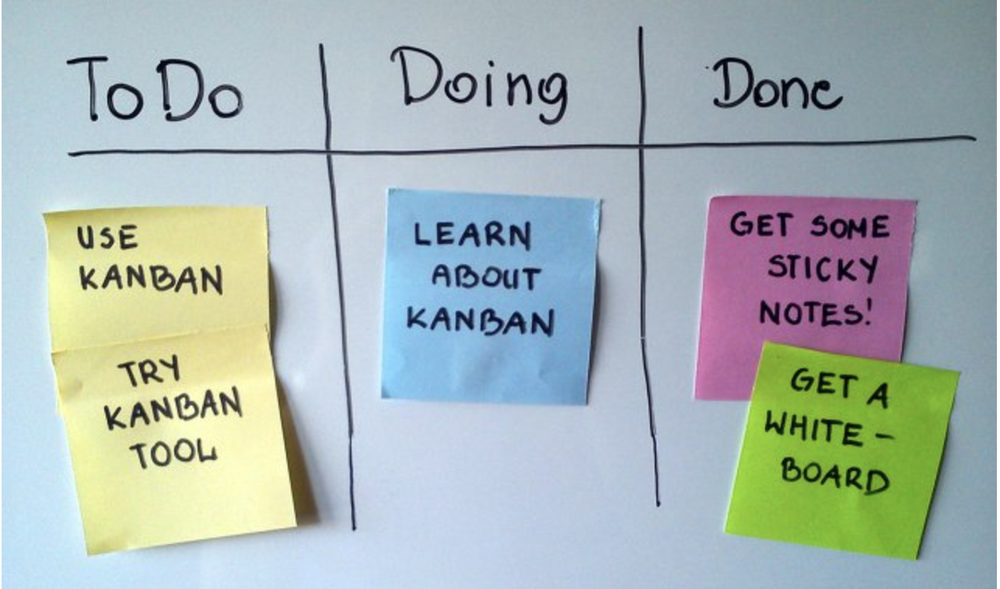
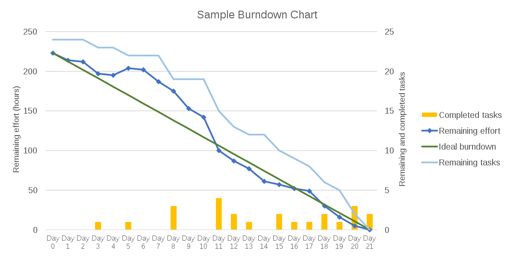
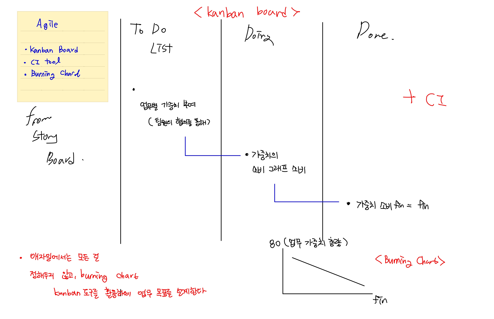

#### [ex01](https://github.com/dntjd7701/react-practice/tree/main/kanban/src/ex01): Property: Component 작성 (Date Flow: Top -> Down)   
- Kanban Board #1
#### ex02:Component Styling                                    
- Kanban Board #1 

## Kanban

상품 스케줄링 시스템 중의 하나로, 기민하게 그리고 적시에 상품을 출시하기 위한 스케줄링 시스템이다.

> kanban board

> kanban definition

Agile 개발 프로세스 전반에 걸친 적시개발(Just In Time Development)을 지원하는 방법론 
- 작업 지시서의 역할
- 애자일과 병행 -> 매우 적은 규칙을 가지고 있어 스크럼과 병행 
- 애자일을 돕는 도구 중 하나로, kanban board, CI(Continuous Integration) tool, burn down chart 중 하나이다.
- 업무별 가중치를 부과하여 번 다운 차트와 함께 업무를 가시적으로 파악할 수 있게 한다.

> Kanban Board example

> Burn down chart

---

